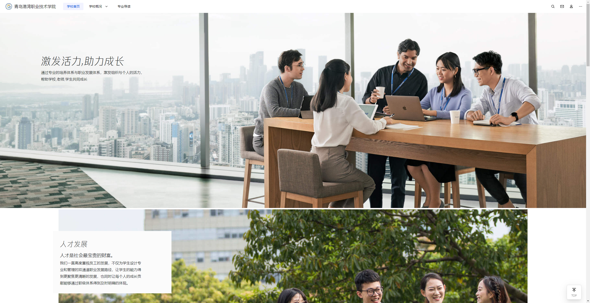
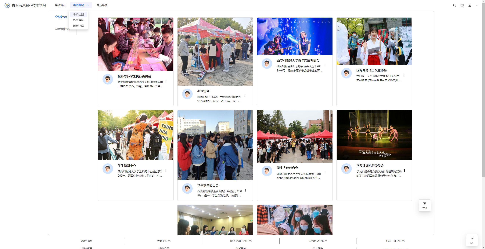
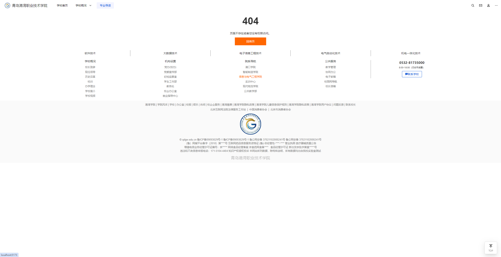

# Vue3-TDesign-Campus-Website
Vue3-TDesign-Campus-Website 是一个使用 Vue3 和 tdesign-vue-next 组件库开发的仿腾讯官方风格的校园网站, 首页借鉴了腾讯官网的字体和部分h5和css代码。
## 特点
- **基于 Vue3**：本项目使用了 Vue3 进行开发，使代码更加简洁和模块化。
- **tdesign-vue-next 组件库**：本项目使用了腾讯出品的 tdesign-vue-next 组件库，使得界面风格与腾讯官方风格保持一致，美观且易于使用。
- **仿腾讯官方风格**：本项目的界面设计模仿[腾讯官网](https://qq.com)，包括首页图片,使得整个网站看起来美观。
- **模块化开发**：本项目采用了模块化开发的方式，将不同的功能模块拆分成不同的组件，使得代码更加清晰和易于维护。
## 安装
```bash
git clone https://github.com/2375137/Campus_website.git
cd Campus_website
npm install
```
## 运行
```bash
npm run serve
或
npm run dev
```
## 预览



## 功能模块
本项目包含了以下几个主要功能模块：
1. **首页**：展示了校园的最新动态和通知，以及校园简介和联系方式。
2. **新闻中心**：展示了校园的新闻资讯，包括校园新闻、行业动态和媒体报道等。
3. **活动中心**：展示了校园的各种活动信息，包括活动预告、活动回顾和活动报名等。
4. **课程中心**：展示了校园的课程信息，包括课程列表、课程详情和课程报名等。
5. **联系我们**：展示了校园的联系方式，包括地址、电话、邮箱和在线留言等。
## 贡献
欢迎对本项目进行贡献，包括但不限于以下方面：
- 修复 bugs
- 添加新功能
- 优化代码和性能
- 提供设计建议和反馈
## 许可证
本项目采用 Apache2.0 许可证，详情请参考 LICENSE 文件。
